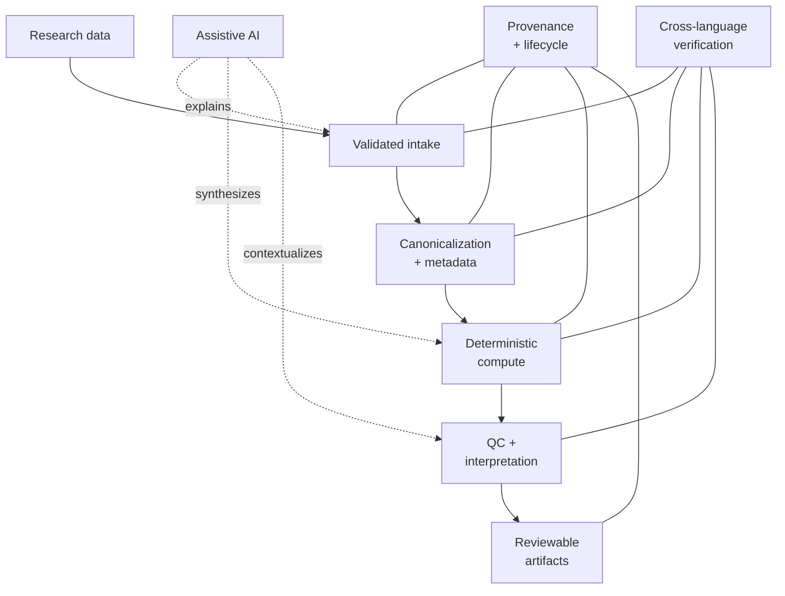

# Zomniverse

**Private research software, public scientific progress.**

Zomniverse is an actively developed research-software platform spanning computational biology, transcriptomics, bioinformatics quality control, toxicogenomics, reproducible analysis, provenance-aware data workflows, and AI-assisted scientific interaction.

The project combines deterministic scientific computation with reviewable data transformations, cross-language validation, local AI acceleration, resilient provider handling, and research-oriented interface engineering. This repository is the public documentation and progress record; the application source remains private while methods and components are validated and prepared for publication.

> **Status:** Active research and development
>
> **Source code:** Private
>
> **Public release model:** Progressive, publication-led disclosure

## Engineering surface

This diagram is intentionally capability-level. It shows engineering responsibilities without exposing private service topology, routes, infrastructure, or implementation wiring.

## Start here

| Document | Purpose |
| --- | --- |
| [Engineering overview](docs/ENGINEERING_OVERVIEW.md) | Capability map, module responsibilities, safeguards, maturity, testing, and resilience |
| [Technology overview](docs/TECHNOLOGY.md) | Languages, frameworks, scientific packages, AI tooling, and engineering responsibilities |
| [Engineering log](docs/engineering/ENGINEERING_LOG.md) | Dated public engineering decisions, problems, validation, and outcomes |
| [Publication policy](WHAT_IS_PUBLISHED_HERE.md) | Mandatory boundary for what may and may not be published here |

## What Zomniverse supports

Zomniverse is designed for research workflows in which biological data, computation, validation, interpretation, and reporting need to remain traceable and reviewable.

Current capability areas include:

- guided tabular-data intake and structural validation;
- RNA-seq preparation through File Reader, Row Namer, and Expression Matrix Canonicalization;
- controlled normalization and quality-control workflows;
- toxicogenomics and nanoparticle-response research;
- provenance-aware scientific artifacts and evidence review;
- deterministic R/Bioconductor computation;
- local-first AI assistance with provider-health and fallback handling;
- responsive scientific workspaces and accessible lifecycle controls;
- cross-language contract, regression, lifecycle, and workflow testing;
- bounded large-file, model-context, and asynchronous-state handling.

The platform is broader than a single analysis pipeline. Modules can be developed, validated, and evolved independently, then connected through controlled transitions and explicit artifact boundaries.

## Current feature areas

| Area | Public status |
| --- | --- |
| Data intake, parsing, and validation | Active development |
| RNA-seq preparation and canonicalization | Active development |
| Normalization and quality control | Controlled research module |
| Nanotoxicology and toxicogenomics | Research stage |
| Reproducibility and provenance | Active development |
| AI-assisted research and evidence synthesis | Active development |
| Scientific reporting and visualisation | Active development |
| Cross-language verification | Active development |
| Public reproducibility packages | Planned as validation and publication permit |

Statuses describe engineering maturity, not clinical, diagnostic, or regulatory validation.

## Engineering principles

### Deterministic science, assistive AI

Quantitative results belong to testable scientific code. Language models can explain, organize, navigate, or synthesize evidence, but generated text is not treated as scientific authority.

### Review before commitment

Where a workflow transforms research data, Zomniverse favors explicit validation and reviewable candidates before acceptance into a downstream stage.

### Provenance and reproducibility

Important artifacts should retain stable identity, origin, relevant parameters, and version context. Scientific environments are controlled rather than assumed.

### Bounded failure

Provider, connectivity, parsing, or interface failures should preserve the last valid state wherever possible rather than silently changing scientific output.

### Modular development

Bounded modules can evolve, be tested, and be evaluated separately. Integration does not remove responsibility for validation at each boundary.

### Controlled disclosure

Private architecture, unpublished methods, operational details, research data, prompts, and experimental components remain private until release is scientifically and operationally appropriate.

## Publication model

As associated work is validated and published, this repository may progressively add:

- publication links and DOIs;
- public method and engineering summaries;
- validated figures and example outputs;
- reproducibility material and selected source components;
- public datasets where licensing and governance allow;
- release notes and public milestones.

A capability being described publicly does not mean its source implementation has been released.

## What is intentionally not public

This is not a mirror of the private application repository. It excludes private source, internal architecture and topology, routes and service addresses, credentials and operational configuration, database internals, unpublished algorithms, private datasets, internal workspaces, prompts, orchestration logic, and collaborator-restricted material.

The complete and authoritative rules are in [WHAT_IS_PUBLISHED_HERE.md](WHAT_IS_PUBLISHED_HERE.md).

## Public roadmap

- [x] Public technology overview
- [x] Public engineering overview
- [x] Engineering-log index
- [x] Capability-level engineering diagrams
- [ ] Public development milestones
- [ ] Publication index
- [ ] Selected screenshots and figures
- [ ] Method summaries released alongside papers
- [ ] Public reproducibility packages where appropriate

## Research context

Zomniverse is being developed in the context of doctoral research in computational biology, transcriptomics, and related bioinformatics applications. Scientific claims, methods, and results will be linked to corresponding publications or public validation material as they become available.

## Maintainer

**Wilder Ruiz**

GitHub: [@wilderruiz](https://github.com/wilderruiz)

---

*Zomniverse is research software under active development. Content in this repository is not clinical, diagnostic, or regulatory guidance.*
