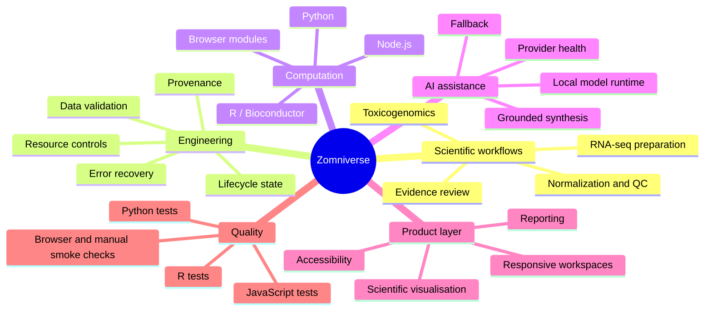
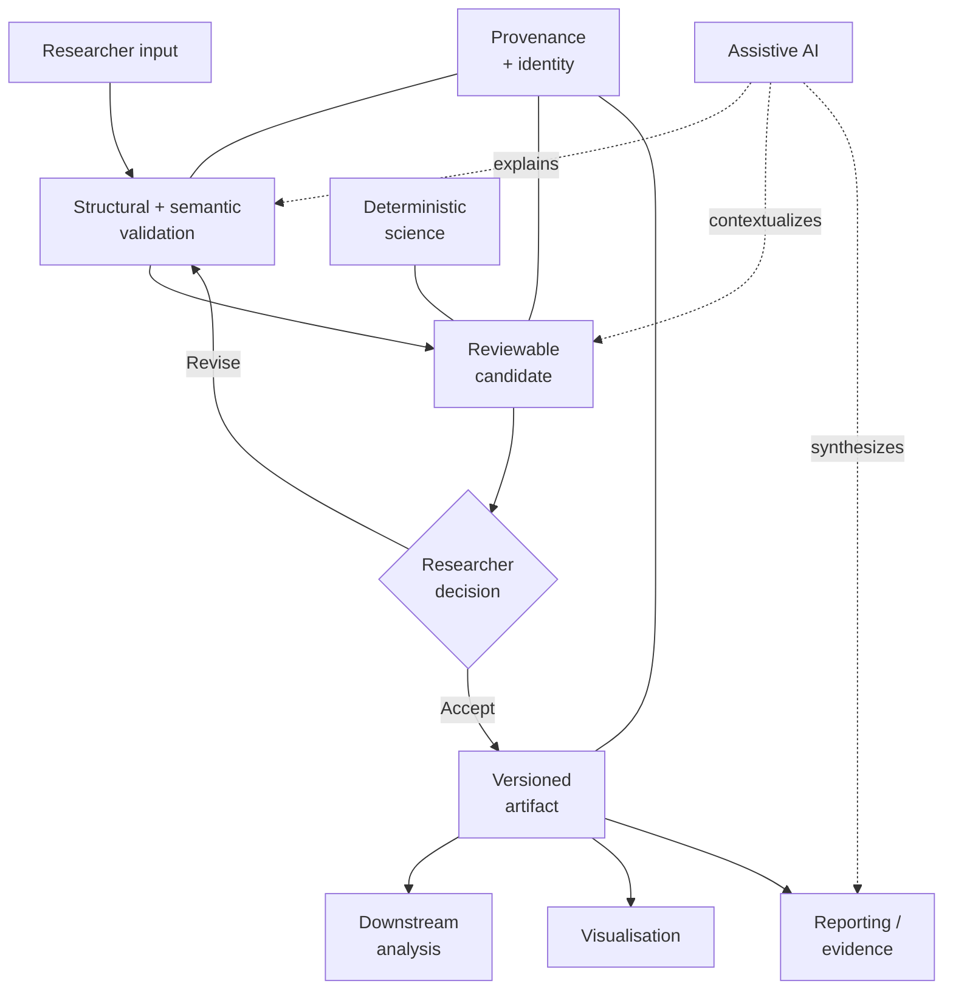
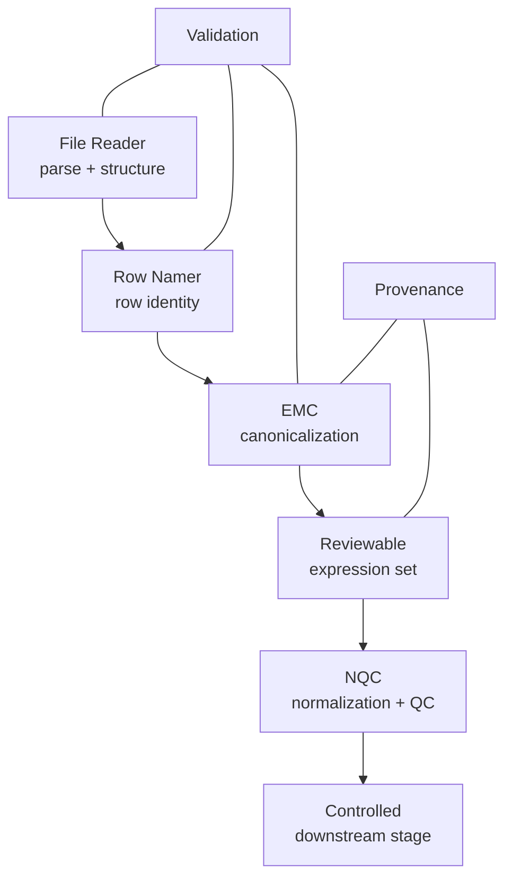
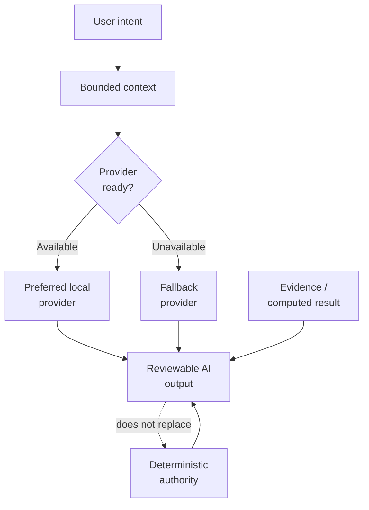
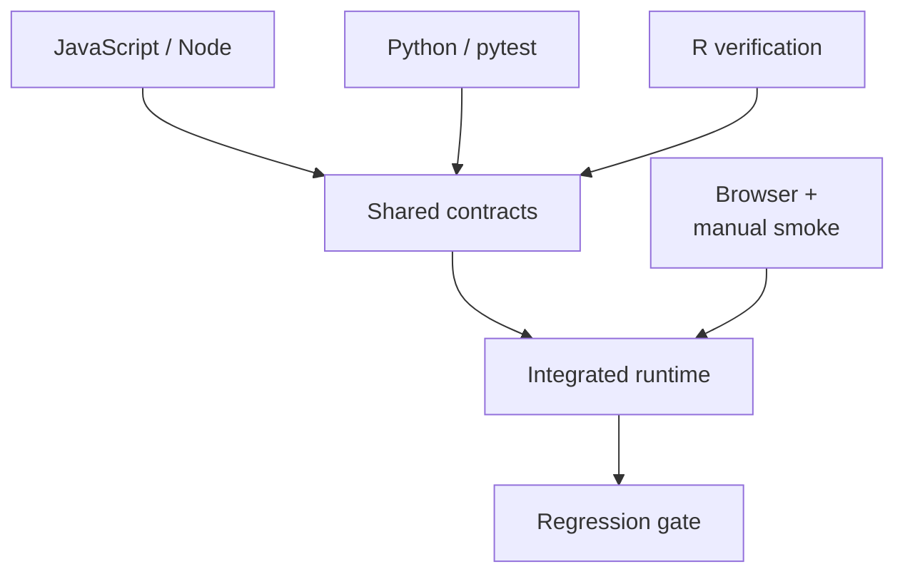

# Zomniverse engineering overview

This document presents a public, capability-level view of Zomniverse engineering. It deliberately omits private source, service topology, routes, ports, infrastructure, security implementation, prompts, unpublished methods, and research data.

**Status:** Active research and development

**Reviewed:** 9 October 2026

## At a glance

| Area | Module or system | Engineering role | Main technologies | Key complexity |
| --- | --- | --- | --- | --- |
| Scientific data | GeneBean / MARSS | Governed preparation of transcriptomic data across bounded stages | JavaScript, R/Bioconductor, Python | State transitions, metadata integrity, review, and provenance |
| Data preparation | File Reader, Row Namer, EMC | Parse files, resolve biological row identity, and produce a consistent expression-matrix candidate | JavaScript, PHP, R, Python | Ambiguous inputs, large files, reversible choices, and structural validation |
| Scientific analysis | NQC | Prepare and assess normalization and quality-control candidates | R/Bioconductor, JavaScript, Plotly.js | Statistical diagnostics, visual review, and candidate-before-commit behaviour |
| Toxicology | GB-Tox | Explore staged toxicogenomic response analysis | R, JavaScript, shared deterministic contracts | Governed signatures, coverage, scoring context, and interpretability |
| AI | ZAR AI | Contextual scientific assistance and evidence-oriented synthesis | JavaScript, Node.js, Python, local Mistral-7B | Provider health, local acceleration, fallback, grounding, and bounded output |
| Data governance | Provenance and artifact workflows | Keep inputs, candidates, evidence, and accepted outputs traceable | JavaScript, Node.js, MariaDB/SQL | Identity, ownership, checksums, lifecycle, and recovery |
| Product engineering | Scientific interface | Present complex workflows responsively and accessibly | ES modules, CSS, PHP, Plotly.js, Mermaid | Fullscreen/compact/mobile states, accessible controls, and error recovery |
| Quality engineering | Cross-language verification | Guard module, integration, lifecycle, and scientific contracts | `node:test`, pytest, R tests, browser checks | Consistency across languages and asynchronous system states |

Statuses describe engineering maturity, not clinical, regulatory, or diagnostic validation.

## Engineering breadth

Zomniverse is not a single-language analysis script or a monolithic web application. The public capability set spans scientific data engineering, deterministic computation, application services, local AI, visualisation, lifecycle controls, provenance, reproducibility, accessibility, and cross-language verification.

This map describes engineering responsibilities, not private component topology.

## Design model

Zomniverse is designed as a set of bounded research modules rather than a single opaque pipeline. A typical governed flow is:

The governing idea is simple: deterministic computation establishes the analytical record; AI can help interpret, explain, or navigate that record, but does not silently replace it.

## Major module inventory

| Module | Purpose | Typical input | Reviewable output | Reliability and safety properties | Authority and status |
| --- | --- | --- | --- | --- | --- |
| File Reader | Introduce tabular research data into a controlled workspace | Research tables and associated file metadata | Parsed preview plus structural findings | Type/shape checks, bounded parsing, large-file safeguards, recoverable errors | Deterministic validation with assistive guidance; active development |
| Row Namer | Resolve the biological identity represented by matrix rows | Parsed expression table and researcher choices | Candidate feature identifiers and row labels | Duplicate/blank handling, explicit choice, reversible review before hand-off | Deterministic transformation with optional AI explanation; active development |
| Expression Matrix Canonicalization (EMC) | Prepare a structurally consistent expression matrix and sample design | Validated matrix, row identity, and sample metadata | Canonicalized matrix candidate with review context | Metadata reconciliation, candidate identifiers, checksums, provenance, review gates | Deterministic core with agent-assisted input/review; active development and final public MARSS stage |
| Normalization & Quality Control (NQC) | Evaluate and prepare a normalization candidate | Governed expression matrix and experimental context | Diagnostics, visual summaries, and normalization candidate | Filtering checks, library/distribution diagnostics, dimensionality views, candidate-before-commit flow | Deterministic R/Bioconductor computation; controlled research module |
| GB-Tox | Investigate toxicogenomic response through staged analysis | Governed expression data, signatures, and analysis configuration | Coverage, score-oriented exploration, figures, and report material | Stage validation, shared deterministic contracts, provenance, interpretable hand-offs | Deterministic analysis with explanatory assistance; research stage |
| ZAR AI | Provide contextual help across explanation, research, computation, coding, and web-supported tasks | User intent plus bounded conversational or artifact context | Synthesis, explanation, computation presentation, or contextual artifact | Provider readiness, task routing, evidence/result separation, bounded context/output, safe fallbacks | AI-assisted; active development and never scientific authority by itself |
| Research evidence workflows | Gather and present request-bound literature evidence | Research question and retrieved publication records | Evidence list and grounded synthesis | Stable source identity, provenance, retrieval/synthesis separation, result preservation on synthesis failure | Deterministic retrieval plus AI synthesis; active development |
| Dataset workspaces | Keep inputs and derived artifacts understandable over time | Curated or user-authorized datasets and metadata | Governed dataset/artifact records | Ownership boundary, provenance notes, lifecycle state, controlled delivery | Deterministic data handling; active development |
| Learn and status surfaces | Present documentation, release state, and module guidance | Versioned documentation and module status records | Searchable guidance and public-safe status presentation | Status vocabulary, version-aware rendering, disclosure controls | Deterministic documentation tooling; active development |

## Scientific workflow engineering

### RNA-seq preparation and MARSS

The public preparation path is intentionally bounded:

It is designed to turn ambiguous tabular input into a reviewable, consistent scientific artifact. Later normalization, quality-control, and analytical stages remain controlled while their methods and validation mature.

Engineering safeguards include:

- early checks for malformed, incomplete, or structurally inconsistent inputs;
- explicit handling of row identity, sample metadata, and experimental design;
- reviewable candidates before an irreversible analytical transition;
- stable artifact identity and checksums where a workflow requires them;
- separation of deterministic transformations from explanatory AI text;
- state-aware guidance that tells the researcher what is missing or unsafe to continue.

### Normalization and quality control

NQC is implemented as a staged scientific workflow rather than a one-click black box. Its public-safe capability profile includes expression filtering, normalization candidate preparation, library and distribution diagnostics, and dimensionality-based quality views. Results are intended for researcher review before they become an accepted downstream input.

### GB-Tox

GB-Tox explores nanotoxicology and toxicogenomic analysis through a staged workflow. Current engineering separates signature definition, coverage assessment, configuration, scoring, exploration, and reporting so that each transition can be validated independently. It remains research-stage software and is not a clinical or regulatory decision system.

## AI-assisted research

Zomniverse uses local language-model tooling for conversational explanation, research synthesis, code-oriented help, and context-sensitive guidance. The interaction layer supports distinct task modes and structured contextual artifacts so that evidence, computed results, and generated explanation remain distinguishable.

The governing rules are:

- AI output is assistive and reviewable;
- deterministic analysis remains authoritative for quantitative results;
- evidence identity and provenance remain visible to the user;
- provider readiness is checked and failures have bounded, intelligible outcomes;
- retrieved or computed artifacts are preserved when a synthesis step fails;
- local acceleration may be used when available, with safe CPU or remote-service fallback governed by the active environment;
- prompts, orchestration policies, and private agent implementation remain private.

The project also uses bounded development-agent workspaces for maintaining subsystem context, evidence, tests, and current-state documentation. These are engineering aids, not autonomous scientific authorities.

## Reliability and research safeguards

| Safeguard | Public engineering intent |
| --- | --- |
| Input validation | Reject or explain malformed files, unsupported shapes, missing metadata, and invalid state transitions early |
| Deterministic authority | Keep quantitative transformations in testable scientific code rather than generated prose |
| Candidate/commit separation | Let researchers inspect a proposed transformation before accepting it |
| Reversibility | Preserve the ability to revise or return to an earlier safe state where the workflow supports it |
| Provenance | Associate artifacts and evidence with stable identity, origin, and relevant version information |
| Failure containment | Preserve usable inputs or retrieved evidence when a later step cannot complete |
| Health awareness | Detect unavailable processing or model providers and communicate a bounded recovery path |
| Resource controls | Apply limits and staged handling to uploads, large matrices, expensive computation, and model context |
| Ownership boundaries | Keep user and project material scoped to the appropriate authenticated context without publishing implementation details |
| Accessible interaction | Use keyboard-operable controls, labels, focus states, responsive layouts, and understandable confirmation flows |

## Cross-cutting engineering inventory

| Concern | Public-safe implementation approach | Maturity |
| --- | --- | --- |
| Scientific ingestion | Staged upload, parsing, preview, structural checks, and explicit hand-off into governed workflows | Active development |
| Metadata handling | Reconcile sample identity, experimental grouping, and biological feature identity before analysis | Active development |
| Large-file handling | Bound uploads and parsing work, avoid unnecessary browser loading, and surface actionable size/shape failures | Active development |
| Security-oriented validation | Authenticate sensitive operations, scope material to its owner, validate state transitions, and avoid trusting client-supplied authority | Active development; implementation remains private |
| Observability and logging | Use bounded diagnostics, lifecycle/audit metadata, and health signals without treating logs as scientific evidence | Active development |
| Provider health | Test processing and model-provider readiness before dependent work and return a clear recovery state | Active development |
| Accelerated/local execution | Prefer local GPU-backed inference when configured and healthy; retain CPU-capable or environment-appropriate alternatives | Development capability |
| Remote execution | Cross controlled application boundaries for heavier computation while preserving user-visible task state | Active development; topology remains private |
| Connectivity resilience | Detect unavailable managed connections, preserve safe state, and support explicit recovery without publishing network wiring | Active development |
| Deployment workflow | Keep public presentation assets, private processing, shared contracts, and environment configuration within reviewed release boundaries | Active development; operational details remain private |
| Module integration | Exchange validated artifacts and runtime-neutral contracts instead of coupling unrelated implementation trees | Active development |
| Admin/developer tooling | Support status inspection, controlled dataset registration, release bookkeeping, workspace guidance, and smoke checks | Internal development tooling |
| Agent-assisted review | Use bounded agents for input assistance, explanation, evidence review, and development context while retaining human approval | Experimental to active, depending on module |
| Versioning and releases | Combine Git history, module release records, environment locks, cache-aware assets, and regression gates | Active development |
| Error recovery | Preserve prior valid state and retrieved artifacts, distinguish retryable provider failure from invalid input, and avoid duplicate mutations | Active development |
| Performance/resource limits | Bound file size, parsing, model context, output, concurrency, and long-list rendering according to the active workflow | Active development |

## Technology by responsibility

| Layer | Principal technologies | Responsibility |
| --- | --- | --- |
| Browser application | JavaScript/ES modules, selected TypeScript, CSS, PHP-rendered pages | Interactive workspaces, validation feedback, scientific presentation, responsive and accessible UI |
| Application services | Node.js, Express, MariaDB/SQL | Controlled orchestration, persistence, lifecycle management, integrations, and governed data access |
| Scientific computation | R, Bioconductor, Plumber | Deterministic bioinformatics computation and analytical validation |
| Validation and research utilities | Python, FastAPI | Bounded validation, evidence preparation, and Python-native processing |
| Local AI | Mistral-7B, llama.cpp-compatible serving | Assistive natural-language generation and interpretation |
| Visualisation and reporting | Plotly.js, Mermaid, Markdown and document-export tooling | Scientific figures, diagrams, evidence presentation, and reviewable reports |
| Reproducibility | Git, renv, Conda, Bioconductor environments | Versioned code and controlled scientific dependencies |
| Verification | `node:test`, pytest, R tests, browser/manual checks | Unit, contract, regression, lifecycle, responsive, accessibility, and integration coverage |

## Validation and testing strategy

The private project contains focused suites across JavaScript, Python, and R. Public-safe coverage areas include:

- module and shared-contract behaviour;
- parsing, identifier handling, metadata, and matrix canonicalization;
- normalization/QC and GB-Tox stage transitions;
- research evidence identity and synthesis contracts;
- AI routing, provider health, response governance, and safe fallbacks;
- chat, project, trash, and authentication lifecycle behaviour;
- responsive layouts, fullscreen/compact views, accessibility, and transient UI;
- release/status presentation, documentation boundaries, and deployment exclusions.

A test file's existence is not treated as proof of scientific validation. Claims should be tied to tests that were actually run and, for research methods, to suitable domain validation and publication evidence.

## Performance and operational resilience

Performance work focuses on bounded parsing, controlled upload and context sizes, lazy presentation of long collections, provider health checks, and separating heavyweight computation from browser interaction. Development can use local GPU acceleration for language-model inference, while the design retains non-GPU paths and explicit failure states. Connectivity and deployment checks are treated as operational concerns rather than silently changing scientific results.

## Why the engineering is multidisciplinary

The complexity of Zomniverse comes from making multiple technical disciplines coexist under one research-governance model:

| Discipline | Engineering requirement |
| --- | --- |
| Bioinformatics | Deterministic, testable scientific computation and domain-specific validation |
| Data engineering | Parsing, metadata reconciliation, identity, provenance, and artifact lifecycle |
| AI engineering | Local model execution, readiness checks, fallback, context governance, and evidence/result separation |
| Product engineering | High-information scientific UX, responsive workspaces, accessibility, and state recovery |
| Backend engineering | Controlled orchestration, persistence, lifecycle operations, and integrations |
| Quality engineering | Cross-language contracts, regression tests, runtime smoke tests, and failure-state validation |
| Reproducibility | Versioned environments, checksums, restore points, and reviewed release boundaries |

The value of this combination is not merely the number of technologies involved; it is the effort required to preserve scientific authority, traceability, and understandable user control while those technologies interact.

## Versioning and release discipline

Zomniverse uses Git-based restore points, explicit module/version presentation, reproducible language environments, regression tests, and reviewable deployment boundaries. Public documentation is released selectively: capability descriptions may be published before source, while methods, reproducibility packages, and datasets are released only when validation, licensing, and research governance permit.

## Disclosure boundary

This overview intentionally does not disclose private architecture, filesystem layout, service addresses, endpoints, database schemas, security controls, prompts, unpublished algorithms, or private datasets. See [What is published here](../WHAT_IS_PUBLISHED_HERE.md) for the governing publication policy and [Technology](TECHNOLOGY.md) for the public stack summary.
