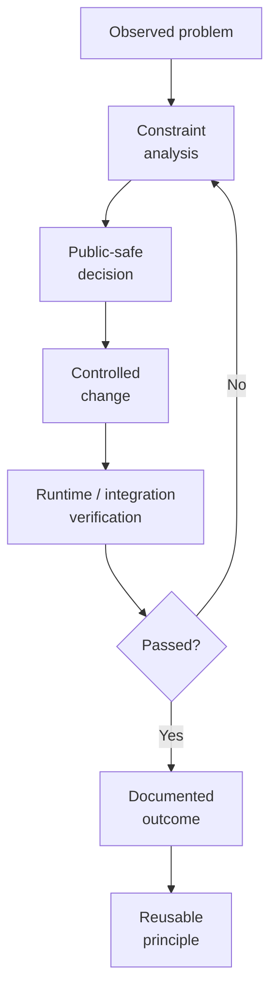
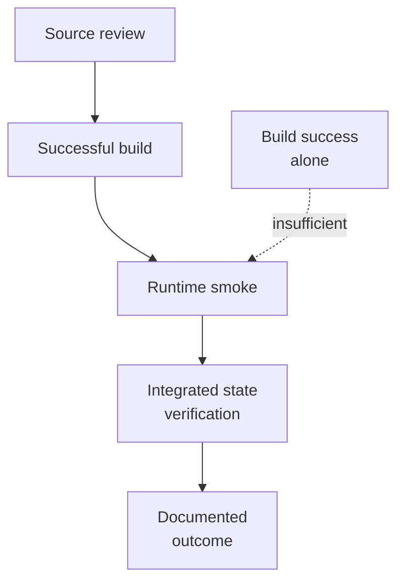

# Zomniverse public engineering log

This index consolidates public engineering notes into a navigable record. The dated source notes remain intact because they preserve problem context, decisions, validation, and outcomes.

Only public-safe engineering work belongs here. Private Zomniverse source, architecture, routes, infrastructure, security implementation, prompts, data, and unpublished methods remain outside this repository under the rules in [What is published here](../../WHAT_IS_PUBLISHED_HERE.md).

## Engineering decision lifecycle

This is the pattern used for public engineering notes: describe the problem, decision, verification, and outcome without exposing private product architecture.

## Entries

| Date | Area | Challenge | Public engineering outcome | Detailed note |
| --- | --- | --- | --- | --- |
| 2026-10-09 | Publication workspace | Keep a curated public history distinct from private product development | Introduced a review-first publication workflow with an explicit public/private boundary | [Review-first publication workspace](2026-10-09_REVIEW_FIRST_PUBLICATION_WORKSPACE_LOG.md) |
| 2026-10-09 | Runtime integration | Resolve competing UI state updates and require an explicit destination choice | Established single-owner timer behaviour, explicit storage selection, and runtime-smoke verification | [Publication workspace runtime smoke and fix](2026-10-09_PUBLICATION_WORKSPACE_RUNTIME_SMOKE_AND_FIX.md) |
| 2026-10-09 | Repository portability | Replace overlapping relocation workflows with one validated operation | Unified repository relocation with preflight checks, state reconciliation, and recoverable failure handling | [Unified Git repository relocation](2026-10-09_UNIFIED_GIT_REPOSITORY_RELOCATION.md) |

## Engineering techniques demonstrated

| Technique | Problem class | Public-safe implementation principle | Result |
| --- | --- | --- | --- |
| Review-first publication boundary | Public/private source separation | Treat publication as a curated product surface rather than an automatic mirror | Public documentation can evolve independently without leaking private implementation |
| Runtime ownership arbitration | Competing asynchronous UI updates | Establish one authoritative owner for recurring state mutation | Removes flicker and timing-dependent regressions |
| Explicit destination selection | Dangerous implicit defaults | Require user intent before filesystem mutation | Prevents accidental writes to an unexpected location |
| Copy → verify → persist → remove | Repository relocation | Verify Git identity and working-tree state before deleting the source | Makes same-drive and cross-drive moves failure-aware and recoverable |
| State reconciliation | Multiple registered projects / histories | Update related state only after destination verification | Reduces split-brain project registrations |
| Runtime smoke testing | Integration defects invisible to static review | Exercise the real desktop workflow after build success | Exposes timer, interaction, and state defects that compilation cannot detect |
| Audit trail | Future maintenance and review | Preserve dated problem/decision/test/outcome records | Converts one-off fixes into reusable engineering knowledge |

## Consolidated themes

| Engineering theme | Technique | Result |
| --- | --- | --- |
| Publication safety | Review-first selection and a documented disclosure boundary | Public progress can be curated without mirroring private source |
| State ownership | One authoritative runtime owner for recurring UI state | Eliminates competing updates and intermittent interface regressions |
| Explicit user intent | Require the user to choose the destination or operation before mutation | Reduces accidental state changes and ambiguous defaults |
| Safe filesystem change | Validate source, destination, repository health, and recoverability before relocation | Repository moves become inspectable and failure-aware |
| Runtime verification | Exercise the integrated desktop workflow after static checks | Finds timing and interaction defects that source review alone can miss |
| Auditability | Preserve dated notes with problem, decision, test, and outcome | Future maintenance has a concise index and a detailed evidence trail |

## Verification ladder

A successful build is necessary but not sufficient for desktop and asynchronous workflow changes. The public notes deliberately distinguish compilation success from runtime validation.

## Entry format for future notes

New public notes should record:

1. date and public status;
2. user-visible problem or engineering constraint;
3. public-safe decision and implementation technique;
4. verification actually performed;
5. outcome and remaining limitations;
6. reusable engineering lesson;
7. links to related public artifacts.

Do not infer validation from implementation alone, and do not publish private implementation detail merely to make an entry more specific.
